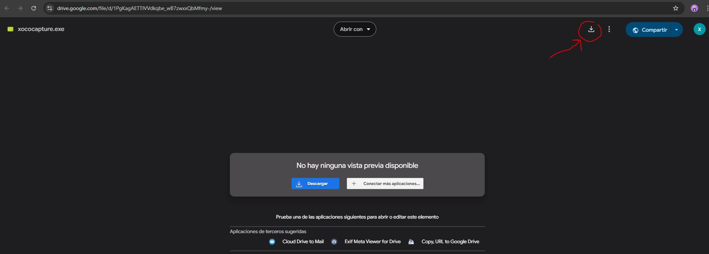
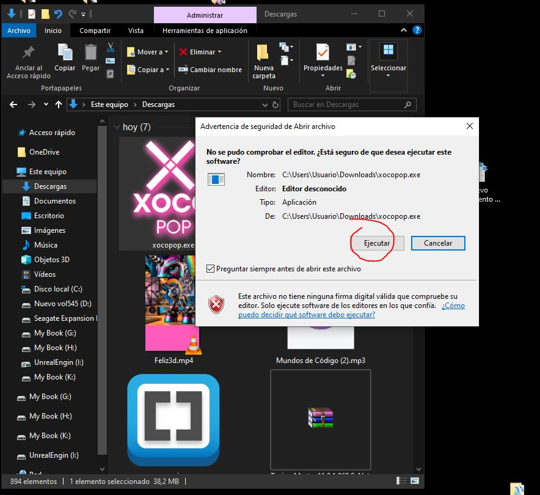

# Xocoboom versión (Hacker Timer)

Hacker Timer es una aplicación desarrollada en Python con PyQt5 que simula un temporizador de estilo "hacker" con una interfaz circular, efectos visuales y una animación final. Es ideal para presentaciones, efectos visuales o simplemente como una herramienta divertida.

## Características
- **Interfaz circular y sin bordes.**
- **Temporizador personalizable.**
- **Animación GIF al finalizar la cuenta regresiva.**
- **Deslizador de opacidad para ajustar la transparencia de la ventana.**
- **Movilidad de ventana con arrastre.**
- **Estilo verde brillante sobre negro, inspirado en estética hacker.**


## Instalación y Ejecución
 Descarga el ejecutable desde el siguiente enlace:
   [Descargar Hacker Timer](https://drive.google.com/file/d/1ba6Y7Yvi1NEAieWGekX9x5g3cPYraDhx/view?usp=sharing)


```

## Uso
- **Iniciar temporizador:** Selecciona el tiempo en el cuadro de entrada y presiona el botón `START`.
- **Abortar temporizador:** Haz clic en el botón `ABORT` para detener el temporizador.
- **Ajustar opacidad:** Usa el deslizador para cambiar la opacidad de la ventana.
- **Mover ventana:** Mantén presionado el botón izquierdo del ratón y arrastra la ventana a la posición deseada.
- **Cerrar la aplicación:** Haz clic en la `X` o presiona `Escape` en la animación final.
```

## Videotutorial
Mira este videotutorial para ver Hacker Timer en acción:
[Ver videotutorial](https://www.youtube.com/watch?v=NsxmHdBRT2Q)

## Capturas de pantalla instalación




## Contribuciones
Las contribuciones son bienvenidas. Realiza un fork del repositorio y envía tus pull requests.

## Licencia
Este proyecto se distribuye bajo la licencia MIT.

---

_Disfruta de Hacker Timer y dale un toque de hacker a tus presentaciones o actividades!_
